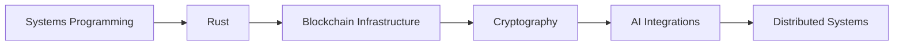
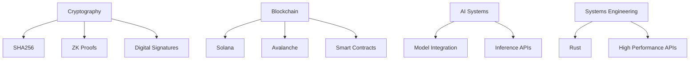
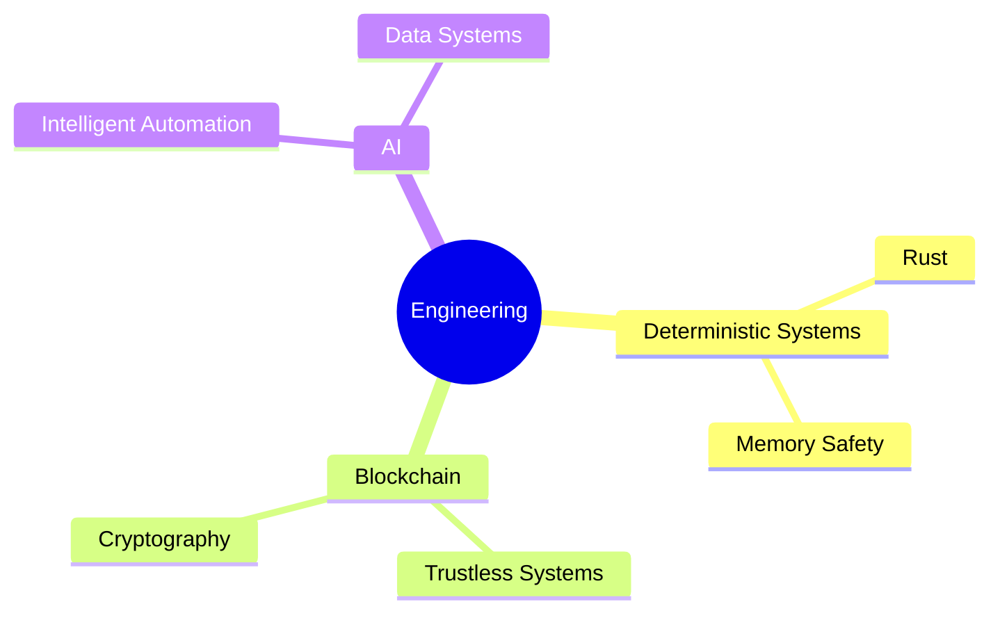

<!-- ================= HEADER ================= -->

<p align="center">
  
</p>

<h1 align="center">Hi 👋 I'm Sushil Dube</h1>
<h3 align="center">Rust Engineer • Blockchain Developer • AI Systems Builder</h3>

<p align="center">
  Building high performance distributed systems using <b>Rust, Blockchain and AI</b>
</p>

---

# 🧠 About Me



* ⚙️ **Rust Engineer focused on high performance systems**
* ⛓️ **Blockchain developer building Web3 infrastructure**
* 🔐 Studying **cryptography and zero knowledge systems**
* 🤖 Integrating **AI models into real world systems**
* 🌍 Active **Open Source Contributor**
* 🚀 Building **blockchain developer tools & infrastructure**

---

# 🚀 Current Focus



---

# ⚙️ Tech Stack

## ⛓ Blockchain

<p align="center">

</p>

* Solana
* Avalanche
* Smart Contracts
* Web3 Infrastructure
* Wallet integrations

---

## ⚙️ Backend Systems

<p align="center">

</p>

* Rust
* Node.js
* Golang
* REST APIs
* Microservices

---

## 🤖 AI / Data

<p align="center">

</p>

* TensorFlow
* Keras
* Pandas
* Model Integration APIs

---

## 🗄 Databases

<p align="center">

</p>

* PostgreSQL
* Redis
* MongoDB

---

## ☁️ DevOps

<p align="center">

</p>

* Docker
* Kubernetes
* CI/CD Pipelines
* Linux Systems

---

# 🧩 Engineering Philosophy



---

# 📊 GitHub Analytics

<p align="center">


</p>

<p align="center">

</p>

---

# 📈 Contribution Activity

<p align="center">

</p>

---

# 🐍 Contribution Snake

<p align="center">

</p>

---

# 🌐 Connect With Me

<p align="center">

<a href="https://www.linkedin.com/in/sushil-dube-81779b137/">

</a>

<a href="mailto:dubesushil99@gmail.com">

</a>

<a href="https://leetcode.com/sushil19">

</a>

</p>

---

# 🧭 Interests

* Blockchain Infrastructure
* Cryptography
* Distributed Systems
* AI Infrastructure
* Open Source

---

# ⚡ Fun Engineering Quote

```
Deterministic systems build trustless worlds.
```

---

<p align="center">

</p>
